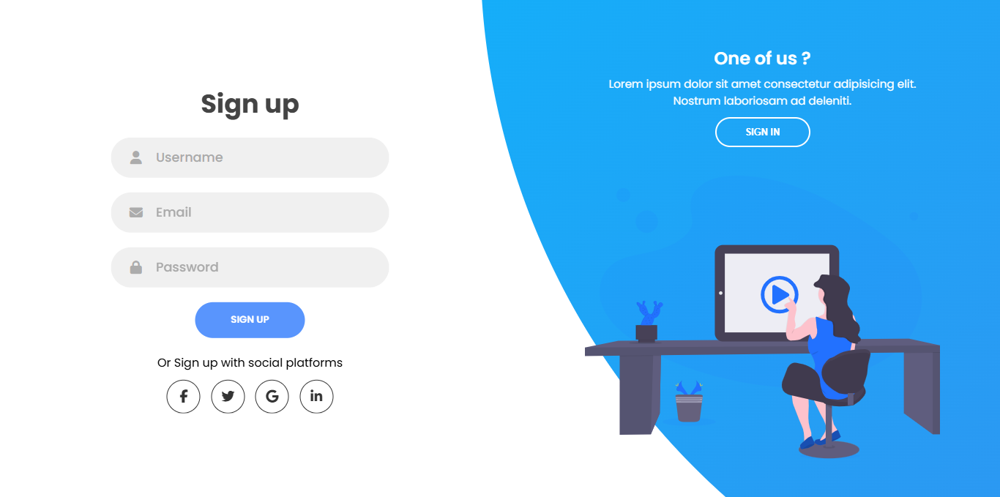
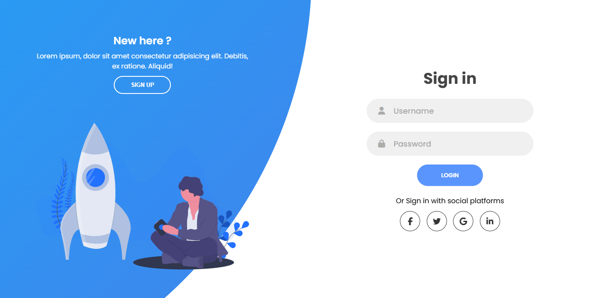

# Middleware & Login !

**Custom Login (without any authentication scaffolding / package , like - Breeze , Jetstream , Fortify , UI , Sanctum , Passport) And Exploring laravel 11 **Middleware**. It's a project about **Custom Login And Middleware**. Also have Uses of **Components**.

## Author

[Fatema Akther Prianka 🤗](https://github.com/Prianka-Mimi)

## Has Been Used

- Html
- css
  - Bootstarp
- JavaScript
  - JQuery (Password Toggle)
  
## View In Short

**Welcome Page**

> Sign Up

> Sign In

> Middleware & Login

## Contact

[🌐 Fatema Akther Prianka](https://webdeveloperprianka.netlify.app/)

[Linkedin](https://www.linkedin.com/in/fatema-akther-prianka/)

[FaceBook](https://www.facebook.com/fatemaaktherprianka.webdeveloper)

[Stack Overflow](https://stackoverflow.com/users/23182049/prianka-mimi)
